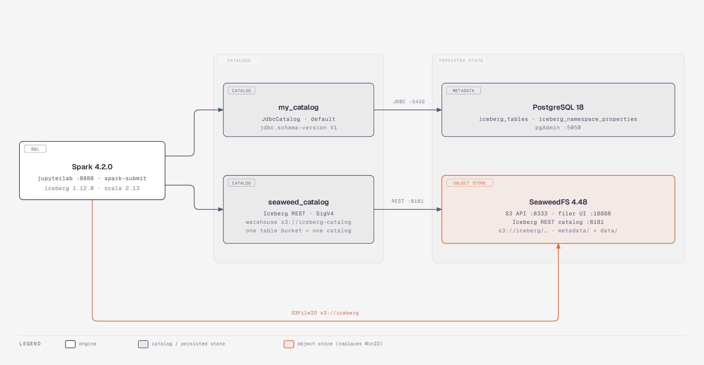
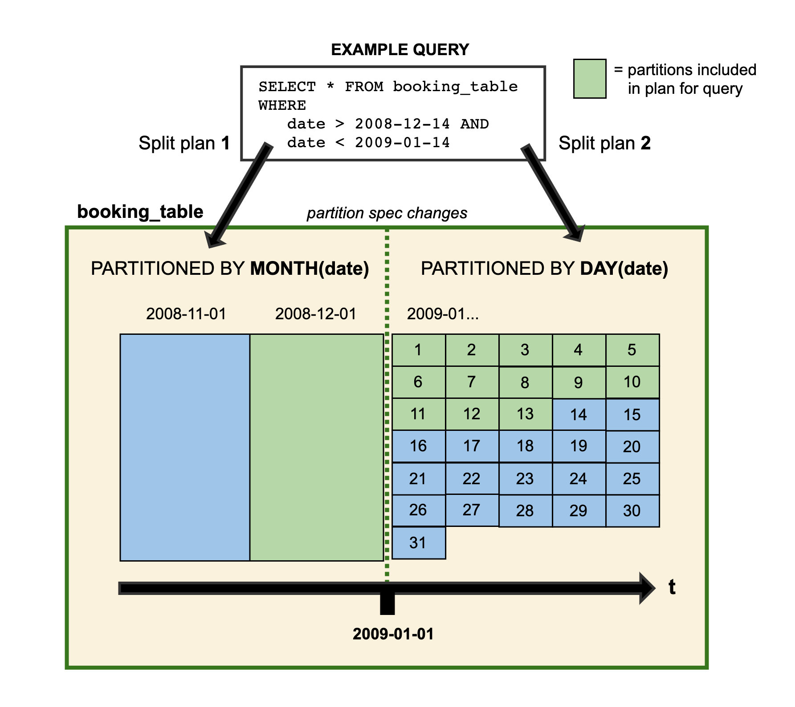
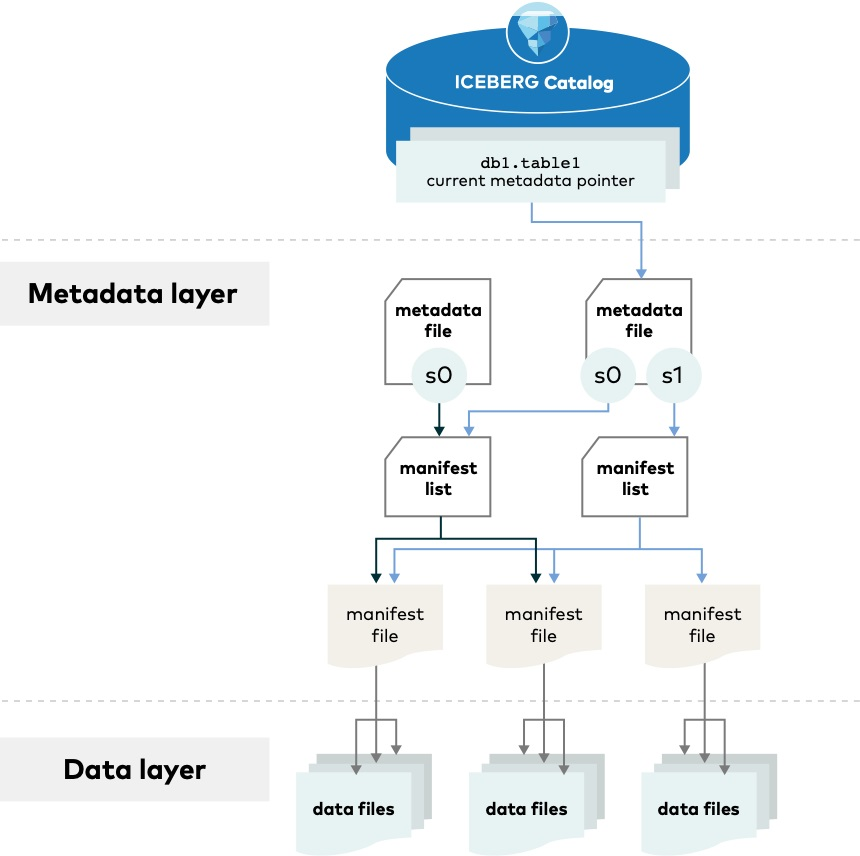

# SeaweedFS + Apache Iceberg 1.12 + Spark 4.2 + JDBC Catalog


> Object storage moved from **MinIO** to **[SeaweedFS](https://github.com/seaweedfs/seaweedfs)**,
> and the stack is now **Apache Spark 4.2.0** + **Apache Iceberg 1.12.0**.

## What's in the box

| Component | Version | Role |
|---|---|---|
| [Apache Spark](https://spark.apache.org/) | 4.2.0 | Compute engine (Python + SQL) |
| [Apache Iceberg](https://iceberg.apache.org/) | 1.12.0 | Open table format |
| [SeaweedFS](https://github.com/seaweedfs/seaweedfs) | 4.48 | S3-compatible object store + Iceberg REST catalog |
| [JDBC](https://iceberg.apache.org/docs/latest/jdbc/) Catalog | Iceberg 1.12.0 | Table metadata in Postgres |
| PostgreSQL | 18.6 | Backing store for the JDBC catalog (latest stable; 19 is beta) |
| pgAdmin | 9.18 | Catalog inspection UI |

Services and host ports:

| Service | Port | URL |
|---|---|---|
| JupyterLab (notebooks) | 8888 | <http://localhost:8888> |
| Spark Web UI | 4040 | <http://localhost:4040> |
| SeaweedFS S3 API | 8333 | <http://localhost:8333> |
| SeaweedFS Iceberg REST catalog | 8181 | <http://localhost:8181> |
| SeaweedFS filer UI | 18888 | <http://localhost:18888> |
| pgAdmin | 5050 | <http://localhost:5050> |
| Postgres | 5432 | `jdbc:postgresql://localhost:5432/icebergcat` |

## Architecture



One compute engine, two catalogs, two stores. Every Iceberg table has its
metadata in a *catalog* and its data files in the *object store*, which is why
the same files can be served through either catalog — and why replacing MinIO
with SeaweedFS only meant pointing `s3.endpoint` at a different host.

The editable source of this diagram is `diagrams/architecture.html`.

---

## Why SeaweedFS instead of MinIO

SeaweedFS is a drop-in replacement here because Iceberg's `S3FileIO` only needs a
standard S3 endpoint — `PutObject`, `GetObject`, `ListObjectsV2`, `HeadObject`
and `DeleteObject`, all of which SeaweedFS implements.

Three things worth knowing:

1. **No more bucket bootstrap container.** `weed mini` starts master + volume +
   filer + S3 + Iceberg REST in one process and creates the buckets named by
   `S3_BUCKET` and `S3_TABLE_BUCKET` on boot, so the old `minio-client`
   container is gone.
2. **No MinIO web console.** SeaweedFS exposes a filer UI on
   <http://localhost:18888> plus a `weed shell` for bucket/table management.
3. **SeaweedFS can also act as the catalog.** It serves the Iceberg REST catalog
   natively on `:8181`, so this repo ships a *second* catalog alongside the
   JDBC one. See [Two catalogs](#two-catalogs).

Storage differences: SeaweedFS splits objects into volumes and chunks and keeps
filer metadata in its own store, so the data under `./warehouse` is not
human-readable the way MinIO's `bucket/…` tree was. Inspect data through the
S3 API or the filer UI instead of the filesystem.

## Getting started

---

### 1. Start the cluster

```bash
docker compose up -d
```

### 2. Open the notebooks

<http://localhost:8888> serves JupyterLab with the notebook in `notebooks/`.

### 3. Or start a PySpark client

```bash
docker compose exec spark-iceberg pyspark
```

---

## Procedure

The walkthrough below loads an SP500 dataset from Yahoo Finance, stores it in
SeaweedFS using the Iceberg spec, and keeps table metadata in Postgres through
the JDBC catalog. It mirrors the original MinIO walkthrough so the Iceberg
concepts stay familiar.

<ins>Main ingredients</ins>

- SeaweedFS S3 gateway + Iceberg REST catalog
- S3 File IO implementation
- JDBC Catalog implementation
- Postgres DB + PGAdmin
- Spark 4.2.0 / Iceberg 1.12.0

---

1. Create a table (the location points at the `iceberg` bucket in SeaweedFS):

```python
spark.sql("""
CREATE TABLE my_catalog.spy_data (
    Date       date,
    Open       double,
    High       double,
    Low        double,
    Close      double,
    Adj_Close  double,
    Volume     integer)
USING iceberg
""")
```

Two tables show up in Postgres — they are created by the JDBC driver on
startup.

2. Import data (only the first 10 years):

```python
from pyspark.sql.functions import *

df = spark.read.csv('/home/spark/data/spy_data.csv', header=True, inferSchema=True)

# inferSchema sets Date to timestamp, so cast it
df = df.withColumn("Date", to_date("Date"))

df_10 = df.filter('Date >= "1993-01-01" AND Date <= "2003-12-31"')
df_10.writeTo('my_catalog.spy_data').append()

spark.sql('select * from my_catalog.spy_data').show()
```

3. Rename the table to `spy_table`:

```sql
ALTER TABLE my_catalog.spy_data RENAME TO spy_table
```

4. Add a `Month` column and make it a partition field:

```sql
ALTER TABLE my_catalog.spy_table ADD COLUMN Month int AFTER Date
UPDATE spy_table SET month = MONTH(Date)
ALTER TABLE my_catalog.spy_table ADD PARTITION FIELD Month
```

5. Insert the next 10 years:

```python
df = df.withColumn('Month', month(df.Date))
df_20 = df.filter('Date >= "2004-01-01" AND Date <= "2023-12-31"')
df_20.writeTo('my_catalog.spy_table').append()
```

Only the new rows land under `month=` folders. Browse them in the filer UI at
<http://localhost:18888> (`iceberg / my_catalog / spy_table / data`) or list them
straight from the object store:

```bash
docker compose exec seaweedfs weed shell -master=seaweedfs:9333 -command="s3.bucket.list"
```



*Source: https://iceberg.apache.org*

Queries look completely normal:

```sql
SELECT * FROM my_catalog.spy_table
WHERE Date >= "2000-01-01" AND Date <= "2010-01-01"
ORDER BY Date DESC
```

Below `2004-01-01` Iceberg reads unpartitioned files; from `2004-01-01` it
prunes into the `month=` partitions. As users we never need to know how the
table is partitioned — this is **hidden partitioning**.

6. Time travel and rollback:

```sql
SELECT * FROM my_catalog.spy_table.snapshots

CALL my_catalog.system.rollback_to_snapshot("spy_table", 1452351276339113816)

SELECT * FROM my_catalog.spy_table VERSION AS OF 337209422568253609
```

---

## New in Iceberg 1.12 / Spark 4.2

`notebooks/iceberg_seaweedfs_demo.ipynb` walks through all of this against the
running stack, with outputs recorded from an actual run. Sections 8-11 cover the
new material; section 16 lists the gaps.

### Spark 4.2.0 — verified working with Iceberg

- **One-statement upserts.** `INSERT INTO … REPLACE WHERE` and
  `INSERT INTO … BY NAME REPLACE WHERE` replace rows by predicate or by column
  name, so a corrected batch needs no staging table:

  ```sql
  INSERT INTO my_catalog.upsert_demo REPLACE WHERE id = 2
  SELECT 2 AS id, 'emea' AS region, 99.5 AS revenue
  ```

- **`QUALIFY`** — window filtering without a wrapping subquery.

- **Vector expressions** — `vector_norm`, `vector_l2_distance`,
  `vector_cosine_similarity` and friends over `ARRAY<FLOAT>`, so distance joins
  run inside Spark instead of exporting the vectors.

- **Row-level operation metrics** — Iceberg `UPDATE` / `DELETE` report
  `numUpdatedRows`, `numDeletedRows` and `numCopiedRows`.

- **DSv2 partition-stats filtering** — Iceberg partition summaries now prune
  during metadata-only deletes.

- **Arrow-optimised Python UDFs and PySpark IPC on by default.**

- `spark.sql.defaultPath` (removed in Spark 3.0) and
  `spark.hadoop.hive.cli.print.header` are gone; both were dropped from
  `spark-defaults.conf`.

### Iceberg 1.12.0

- **The JDBC catalog now needs `jdbc.schema-version=V1`.** View support is
  opt-in, and without the property the catalog rejects *every* operation:

  ```text
  UnsupportedOperationException: JDBC catalog is initialized without view support.
  To auto-migrate the database's schema and enable view support, set jdbc.schema-version=V1
  ```

- **Spark 3.4 support dropped.** Iceberg 1.12 targets Spark 3.5 and 4.x, which is
  why the runtime artifact is `iceberg-spark-runtime-4.1_2.13` (the Spark 4.x
  line, Scala 2.13).

- **`iceberg-aws-bundle` is mandatory.** Since Iceberg 1.3 the AWS SDK v2 is no
  longer shaded into the Spark runtime, and neither Iceberg artifact declares
  dependencies, so `spark.jars.packages` cannot pull it in transitively. Without
  it `S3FileIO` dies with `NoClassDefFoundError`.

- **Table format v4 groundwork** — relative metadata locations, content stats in
  the spec, Parquet/Avro manifests.

### Announced in the Spark 4.2.0 notes but not actually in 4.2.0

These are in the 4.2.0 release notes but not in its SQL reference, and all three
fail on this stack. Worth knowing before you plan around them:

| Feature | Ticket | What happens |
|---|---|---|
| `INSERT … WITH SCHEMA EVOLUTION` | SPARK-54971 | `PARSE_SYNTAX_ERROR` at `EVOLUTION` |
| `INSERT … REPLACE ON/USING` | SPARK-56001 | `UNRESOLVED_ROUTINE USING` |
| `GEOMETRY` / `GEOGRAPHY` types and `ST_*` | SPARK-51658 | `UNSUPPORTED_DATATYPE GEOMETRY`; no `ST_*` in `SHOW FUNCTIONS` |

`TABLESAMPLE SYSTEM` *does* parse (SPARK-55978), but Iceberg's scan does not
implement block-level sampling, so you get a clear
`UNSUPPORTED_FEATURE.TABLESAMPLE_SYSTEM`. Use a pre-filter instead.

## Choosing between a snapshot and released artifacts

Iceberg 1.12.0 publishes `iceberg-spark-runtime-{3.5,4.0,4.1}_2.13` — there is
no `4.2_2.13` artifact. And Spark 4.2.0 turned
`connector.catalog.View` from an interface into a class, so the 4.1 runtime
cannot be loaded by Spark 4.2 at all:

```text
IncompatibleClassChangeError: class org.apache.iceberg.spark.source.SparkView
  can not implement org.apache.spark.sql.connector.catalog.View, because it is
  not an interface
```

To get Spark 4.2.0 running, this repo pins the era-matched snapshot pair and
resolves it from the Apache snapshot repository through `spark/ivysettings.xml`:

```
org.apache.iceberg:iceberg-spark-runtime-4.2_2.13:1.12.0-SNAPSHOT
org.apache.iceberg:iceberg-aws-bundle:1.12.0-SNAPSHOT
```

Both must be snapshots of the same build. Iceberg 1.12.0's release cut also
switched `HttpClientProperties` from Apache HttpClient 4 to 5, so the released
`iceberg-aws-bundle:1.12.0` (HttpClient 5) is incompatible with the last
published 4.2 runtime snapshot (HttpClient 4) — pairing them fails with
`NoClassDefFoundError: software/amazon/awssdk/http/apache/ApacheHttpClient$Builder`.

### Switching to released artifacts

If you would rather use released jars, drop to Spark 4.1.3. That combination was
also tested for this repo and works, with one trade-off:

1. `spark/Dockerfile`:
   `ARG SPARK_IMAGE=apache/spark:4.1.3-python3`
2. `spark/spark-defaults.conf`:
   ```properties
   spark.jars.packages    org.apache.iceberg:iceberg-spark-runtime-4.1_2.13:1.12.0,org.apache.iceberg:iceberg-aws-bundle:1.12.0,org.postgresql:postgresql:42.7.13
   ```
3. Delete `spark.jars.ivySettings` (no longer needed) and `spark/ivysettings.xml`.

With Spark 4.1.3 the Iceberg **view** feature works, but the Spark 4.2 SQL
surface does not: `BY NAME REPLACE WHERE`, `QUALIFY` and the vector functions
are all absent.

---

## Gotchas ledger

> **Read this before bumping any version.**
> Every entry below was hit while building this stack and reproduced against
> this repo. None of it is documented in any single project's release notes.
> Each row says what breaks, how it presents, and **what to re-check when
> versions move** — delete an entry only when the new version demonstrably fixes
> it, never on the strength of a changelog line alone.

### A. Upstream breakage, fixed here

| # | Gotcha | Error you see | Fix in this repo | Re-check when |
|---|---|---|---|---|
| A1 | Since Iceberg 1.3 the AWS SDK v2 is no longer shaded into the Spark runtime, and **neither Iceberg artifact declares dependencies** — so Ivy cannot pull it transitively | `NoClassDefFoundError: software/amazon/awssdk/...` | `iceberg-aws-bundle` listed explicitly in `spark.jars.packages` | Any Iceberg upgrade; if the bundle is ever folded back in, the extra coordinate becomes dead weight |
| A2 | Iceberg 1.12 gave the JDBC catalog view support and made it **opt-in**. Without the migration flag it rejects *every* operation, not just views | `UnsupportedOperationException: JDBC catalog is initialized without view support ... set jdbc.schema-version=V1` | `spark.sql.catalog.my_catalog.jdbc.schema-version V1` | Any Iceberg upgrade — check whether V1 is still the current schema level, and whether the flag is still required |
| A3 | The `apache/spark` image creates the `spark` user with home `/nonexistent`. **`gosu` resets `HOME` from `/etc/passwd`**, so setting `ENV HOME` alone is not enough | `PermissionError: '/nonexistent'` from Jupyter; Ivy cache falls back to `/root` | `usermod --home /home/spark spark` in `spark/Dockerfile` | Any base-image change to the `spark` user |
| A4 | `spark-submit` puts PySpark on `PYTHONPATH` for itself, but a **Jupyter kernel is started directly** and so has no such path | `ModuleNotFoundError: No module named 'pyspark'` in every notebook cell | `spark-python.pth` in the venv's `site-packages`, globbing `$SPARK_HOME/python` and the py4j zip | Spark layout changes, or moving off the venv |
| A5 | `spark.local.dir` must be writable by uid 185. The container runs as root to fix mounts, so a root-created dir is unusable by the Spark process | `Failed to create any local dir` | `start.sh` chowns `spark-local` and `spark-events` before dropping privileges | Any change to the entrypoint or the uid |
| A6 | SeaweedFS selects an Iceberg catalog from the **`warehouse` property**, not from a URI prefix — and serves only unprefixed `/v1/...` paths | `NoSuchWarehouseException: Path not found`, or `table bucket warehouse not found` | `…uri http://seaweedfs:8181` + `…warehouse s3://iceberg-catalog` | SeaweedFS routing changes; if path prefixes ever work, the separate `warehouse` line may become unnecessary |
| A7 | A SeaweedFS **table bucket cannot share a name with a plain S3 bucket**, and `s3tables.bucket` requires `-account` | `error: -account is required`, or `bucket X already exists` | Only `S3_TABLE_BUCKET` is declared; `weed mini` creates both correctly | SeaweedFS bucket-naming rules change |
| A8 | `weed mini` needs `-ip` set to the service name or the filer advertises an unreachable address to the other containers | Tables created by one container are invisible to another | `-ip=seaweedfs -ip.bind=0.0.0.0` | Not likely to regress |

### B. Version incompatibilities — the hard ones

| # | Gotcha | Error you see | Status here | Re-check when |
|---|---|---|---|---|
| B1 | **There is no released `iceberg-spark-runtime-4.2_2.13`.** Iceberg 1.12.0 publishes runtimes only for Spark 3.5 / 4.0 / 4.1 | Artifact 404 from Maven Central | Pinned the era-matched `1.12.0-SNAPSHOT` pair | Iceberg 1.12.1+ — if `4.2_2.13` ships, drop the snapshot and use released jars |
| B2 | Spark 4.2 turned `connector.catalog.View` from an **interface into a class**, so the released 4.1 Iceberg runtime cannot even load on Spark 4.2 | `IncompatibleClassChangeError: SparkView can not implement ... View, because it is not an interface` | Same snapshot pin as B1 | Once a released 4.2 runtime exists, this is moot |
| B3 | The 1.12.0 release cut also moved `HttpClientProperties` from **Apache HttpClient 4 to 5**, so released `iceberg-aws-bundle:1.12.0` does **not** match the last published 4.2 runtime snapshot | `NoClassDefFoundError: software/amazon/awssdk/http/apache/ApacheHttpClient$Builder` | Both artifacts pinned to the *same* snapshot build | Any Iceberg upgrade — the runtime and the AWS bundle must always be the same build |
| B4 | Apache **prunes old snapshots**, so a pinned snapshot silently stops resolving | Ivy reports the dependency missing | No fix available; this is the known cost of B1 | Periodically, and at every upgrade |
| B5 | Iceberg **views do not work on Spark 4.2** at all | `SparkException: [INTERNAL_ERROR] The Spark SQL phase analysis failed` (AssertionError in `CatalogV2Implicits.asLegacyTableIdentifier`) | Unfixed and documented; reproduced on 1.12.0, its snapshot, and 1.13.0-SNAPSHOT | An Iceberg release that targets Spark 4.2's `View` class. Note this is a *different* bug from B2 and is not fixed by leaving the snapshot |
| B6 | Three features are in the Spark 4.2.0 **release notes but not in its SQL reference**, and do not exist in the parser | `WITH SCHEMA EVOLUTION` → `PARSE_SYNTAX_ERROR`; `REPLACE ON/USING` → `UNRESOLVED_ROUTINE USING`; `CAST(… AS GEOMETRY)` → `UNSUPPORTED_DATATYPE`, no `ST_*` in `SHOW FUNCTIONS` | Not claimed anywhere. Working substitutes are documented: `REPLACE WHERE`, `BY NAME REPLACE WHERE` | Spark 4.3+ — worth re-testing all three before documenting them |

### C. Runtime quirks with no clean fix

| # | Gotcha | Error you see | Workaround here | Re-check when |
|---|---|---|---|---|
| C1 | Iceberg's JDBC catalog has **no `default` namespace** | `NoSuchNamespaceException` from `SHOW TABLES IN <catalog>` | `SHOW NAMESPACES`, or qualify the namespace | Unlikely to change; it mirrors the JDBC layout |
| C2 | `remove_orphan_files` walks directories through **Hadoop's `FileSystem`**, which has no `s3://` implementation in this image | `UnsupportedFileSystemException: No FileSystem for scheme "s3"` | `prefix_listing => true` to route through Iceberg's `FileIO` | Prefer the `FileIO` path if a future Iceberg makes it the default |
| C3 | `TABLESAMPLE SYSTEM` parses, but Iceberg's scan **does not implement block-level sampling** | `UNSUPPORTED_FEATURE.TABLESAMPLE_SYSTEM` | Pre-filter in the query | If Iceberg implements `SupportsReportStatistics` block sampling |
| C4 | Copy-on-write `DELETE`/`UPDATE` with a predicate that matches **only part of a data file** | `ValidationException: Cannot delete file where some, but not all, rows match filter` | Match whole files, or set `write.delete.mode = merge-on-read` | Unlikely to change; it is Iceberg's intended CoW safety check |
| C5 | Iceberg's AWS property keys are `s3.access-key-id` / `s3.secret-access-key`, **not** the `s3.access-key` / `s3.secret-key` used in SeaweedFS's own wiki | Credentials silently not applied | Correct keys in `spark-defaults.conf` | If Iceberg ever aliases the short forms |
| C6 | The notebook must be **re-runnable**: leftovers from a previous run make `CREATE VIEW`/`RENAME TO` fail | `TABLE_OR_VIEW_ALREADY_EXISTS`, `WRONG_COMMAND_FOR_OBJECT_TYPE` (a view cannot be dropped with `DROP TABLE`) | Section 1 drops leftovers; cleanup uses `DROP VIEW` for views | Only if the notebook is restructured |
| C7 | A table bucket created via `weed shell` is **not** equivalent to one created at boot by `weed mini`; the Iceberg REST handler then reports it as not found | `table bucket iceberg-catalog not found` | Let `weed mini` create it via `S3_TABLE_BUCKET` | If `weed shell` gains parity with the boot path |

### D. Deliberate choices, not accidents

| Choice | Why | Cost if reversed |
|---|---|---|
| Postgres pinned to `18.6`, not `18` | Reproducible. 18 is the latest **stable** major; 19 is beta-only as of 2026-09 | None — bump the minor to pick up fixes |
| Two catalogs, not one | Shows that metadata location is swappable while the data files stay put | More surface to explain |
| No Hadoop AWS bundle | Iceberg handles S3 through `S3FileIO`; bare `s3://` DataFrame paths are not needed | Would add `s3://` support to plain `spark.read`/`write` |
| Ports remapped (Jupyter 8888, Spark UI 4040, filer UI 18888) | Jupyter and the SeaweedFS filer both default to 8888 | Host port clashes if reverted |
| MinIO screenshots deleted | They document a system that no longer exists and would mislead | None |

### Verification recipe

The single command that proves the stack still works after a version bump.
Run it from a clean slate — leftovers hide exactly the failures listed above.

```bash
docker compose down -v && rm -rf warehouse/* && touch warehouse/.gitkeep
docker compose up -d && sleep 15
docker compose exec -u spark spark-iceberg \
  jupyter nbconvert --to notebook --execute --output /tmp/check.ipynb \
  /home/spark/notebooks/iceberg_seaweedfs_demo.ipynb
```

Exit status 0 means all 37 code cells ran. Then confirm the endpoints:

```bash
# Both are created lazily on the first catalog operation, so check them after.
docker compose exec db psql -U icebergcat -d icebergcat -c '\dt'   # iceberg_tables, iceberg_namespace_properties
curl -s http://localhost:8181/v1/namespaces                        # {"namespaces":[]}
```

On a fresh stack `\dt` reports *no tables* until something touches the JDBC
catalog — `docker-entrypoint-initdb.d` only sets the role password. That is
expected, not a failure.

Two diagnostics are **expected** and are not regressions:

* Section 11 (`NEW in Iceberg 1.12`) prints the B5 Iceberg-views failure — it
  catches it on purpose.
* Section 16 (`Gaps you will hit on this stack`) prints the B6
  `TABLESAMPLE_SYSTEM` and `GEOMETRY` diagnostics.

Any error outside those two means something regressed. When it does, check
whether it is listed above; if not, add a new row with the exact error text —
that is how this table stays useful instead of going stale.

## Two catalogs

`spark/spark-defaults.conf` registers two catalogs against the same SeaweedFS
cluster:

| Name | Type | Storage | Notes |
|---|---|---|---|
| `my_catalog` | `org.apache.iceberg.jdbc.JdbcCatalog` | `s3://iceberg` | Table metadata in Postgres. The default catalog. |
| `seaweed_catalog` | Iceberg REST catalog | `s3://iceberg-catalog` | Served by SeaweedFS itself on `:8181`, SigV4 authenticated. |

`my_catalog` is what the walkthrough uses. `seaweed_catalog` exists to show
that the same tables can be published through a REST catalog, which is what
lets other engines (Trino, DuckDB, RisingWave, Dremio, Doris, Lakekeeper) read
the data without a shared Postgres.

```python
spark.sql("CREATE NAMESPACE IF NOT EXISTS seaweed_catalog.demo")
spark.sql("""
CREATE TABLE IF NOT EXISTS seaweed_catalog.demo.t_rest (id INT, s STRING)
USING iceberg
""")
spark.sql("INSERT INTO seaweed_catalog.demo.t_rest VALUES (1, 'x'), (2, 'y')")
spark.sql("SELECT * FROM seaweed_catalog.demo.t_rest ORDER BY id").show()
```

## Example queries

---

### Count

```sql
SELECT COUNT(1) AS count, Geography
FROM my_catalog.bank_customers
GROUP BY Geography
ORDER BY count DESC
```

### Schema changes

```sql
ALTER TABLE my_catalog.spy_table RENAME TO new_table_name
ALTER TABLE my_catalog.spy_table ALTER COLUMN Open AFTER High
ALTER TABLE my_catalog.spy_table ADD COLUMN note string
```

### Partition changes

```sql
ALTER TABLE my_catalog.spy_table ADD COLUMN month int AFTER Date
UPDATE spy_table SET month = MONTH(date)
ALTER TABLE my_catalog.spy_table ADD PARTITION FIELD month
```

### Time travel and rollback

```sql
SELECT * FROM my_catalog.spy_table TIMESTAMP AS OF '1986-10-26 01:21:00';
SELECT * FROM my_catalog.spy_table VERSION AS OF 1684149281931;

CALL my_catalog.system.rollback_to_timestamp('spy_table', TIMESTAMP '2022-07-25 12:15:00.000');
CALL my_catalog.system.rollback_to_snapshot('spy_table', 1452351276339113816);
```

### Branches and tags

```sql
ALTER TABLE my_catalog.spy_table CREATE BRANCH audit
ALTER TABLE my_catalog.spy_table CREATE TAG release_1 AS OF VERSION 1452351276339113816

INSERT INTO my_catalog.spy_table.branch_audit VALUES (...)
SELECT * FROM my_catalog.spy_table VERSION AS OF 'audit'
SELECT * FROM my_catalog.spy_table.refs
```

### Maintenance

```sql
CALL my_catalog.system.rewrite_data_files(table => 'spy_table')
CALL my_catalog.system.rewrite_manifests(table => 'spy_table')
CALL my_catalog.system.expire_snapshots(table => 'spy_table', retain_last => 5)
CALL my_catalog.system.remove_orphan_files(table => 'spy_table', dry_run => true)
```

### Metadata tables

```sql
SELECT * FROM my_catalog.spy_table.files;
SELECT * FROM my_catalog.spy_table.manifests;
SELECT * FROM my_catalog.spy_table.history;
SELECT * FROM my_catalog.spy_table.snapshots;
SELECT * FROM my_catalog.spy_table.partitions;

SELECT h.made_current_at, s.operation, h.snapshot_id, h.is_current_ancestor,
       s.summary['spark.app.id']
FROM my_catalog.spy_table.history h
JOIN my_catalog.spy_table.snapshots s ON h.snapshot_id = s.snapshot_id
ORDER BY made_current_at;
```

## Exploring SeaweedFS

```bash
# bucket + Iceberg table-bucket inventory
docker compose exec seaweedfs weed shell -master=seaweedfs:9333
#   s3.bucket.list
#   s3tables.bucket -list

# create a bucket by hand
docker compose exec seaweedfs weed shell -master=seaweedfs:9333 \
  -command="s3.bucket.create -name my-bucket"
```

Any S3 client works against <http://localhost:8333> with
`icebergadmin` / `icebergadmin` (see `config/seaweedfs-s3.json`).

## Iceberg schema

---

Metadata.json >> (Snapshot) Manifest list [manifest file locations] >> Manifest files (.avro per snapshot)

- <ins>Metadata files (JSON)</ins>: table schema, partition spec, snapshot details.
- <ins>Manifest list</ins>: which manifest files belong to a snapshot, and how many
  data files were added or deleted per partition.
- <ins>Manifest files</ins>: the `.parquet`/`.orc`/`.avro` data files plus their
  statistics and partition values.
- <ins>Data files</ins>: the rows.

So SQL operations hit one of two layers:

* **Metadata layer** — anything about tables (add, alter, drop, rename).
* **Data layer** — anything about rows (insert, update, delete).

Metadata operations are fast because they only rewrite small JSON files.



*Source: https://iceberg.apache.org/spec/*

## What replaced what

| Before (MinIO) | After (SeaweedFS) |
|---|---|
| `minio/minio` service | `seaweedfs` service (`chrislusf/seaweedfs:4.48`, `weed mini`) |
| `minio/mc` bucket bootstrap | `S3_BUCKET` / `S3_TABLE_BUCKET` env vars on the `seaweedfs` service |
| MinIO console on `:9001` | SeaweedFS filer UI on `:18888` |
| `spark-iceberg` from `tabulario/spark-iceberg` (Spark 3.3.2, Iceberg 1.2.1) | `apache/spark:4.2.0-python3` + JupyterLab 4.6.4, Iceberg 1.12.0 |
| `tabulario/iceberg-rest` on `:8181` (unused by Spark) | SeaweedFS' own Iceberg REST catalog on `:8181`, wired up as `seaweed_catalog` |
| Postgres 10.5 | Postgres 18.6 (pinned minor) |
| `spark/jars/postgresql-42.6.0.jar` | `org.postgresql:postgresql:42.7.13` via `spark.jars.packages` |
| JDBC password `minio` | JDBC password `iceberg` |
| Spark UI on `:8080` | Spark UI on `:4040` (8888 kept for Jupyter, 18888 for the filer UI) |
| No healthchecks | healthchecks on `seaweedfs` and `db`, with `depends_on: condition: service_healthy` |
| No notebooks in the repo | `notebooks/iceberg_seaweedfs_demo.ipynb`, committed with recorded output |

Other fixes that came along for the ride are catalogued as A1-A8 in the
[Gotchas ledger](#gotchas-ledger): the `spark` user's `/nonexistent` home
breaking Jupyter and the Ivy cache, the `.pth` file that lets Jupyter kernels
`import pyspark`, and `spark/Dockerfile` now building from
`apache/spark:4.2.0-python3` rather than the `tabulario` image.

`spark/spark-defaults.conf` intentionally keeps the Iceberg versions in one
place. To bump Iceberg, change `iceberg-spark-runtime-*` **and**
`iceberg-aws-bundle` to the same version — they must match (B3), and the runtime
artifact has to exist for your Spark line (B1).

## Troubleshooting

For the full ledger — every error, its cause, and what to re-check on the next
version bump — see the [Gotchas ledger](#gotchas-ledger). That section is the
durable record; this one is the quick lookup.

| Symptom | Cause | Fix |
|---|---|---|
| `NoClassDefFoundError: software/amazon/awssdk/...` | `iceberg-aws-bundle` missing, or runtime/AWS-bundle versions mismatched | List the bundle in `spark.jars.packages`; keep both at the same version (A1, B3) |
| `IncompatibleClassChangeError: … SparkView can not implement … View` | Iceberg runtime predates Spark 4.2's `View` interface→class change | Use a 4.2-targeted runtime (B1, B2) |
| `JDBC catalog is initialized without view support` | Iceberg 1.12 made the JDBC schema migration opt-in | Set `jdbc.schema-version V1` (A2) |
| `NoSuchWarehouseException` / `table bucket warehouse not found` | Catalog selected by URI prefix instead of `warehouse` | Set `warehouse`, keep the URI bare (A6) |
| `No FileSystem for scheme "s3"` from `spark.read`/`write` | Bare `s3://` goes through Hadoop, which has no S3 here | Use Iceberg tables, or add the Hadoop AWS bundle (C2, D) |
| `UnsupportedOperationException` on any SQL statement | `spark.local.dir` unwritable by uid 185 | `start.sh` chowns it; don't bypass the entrypoint (A5) |
| `PermissionError: '/nonexistent'` | Jupyter/Ivy `HOME` reset by `gosu` | The Dockerfile already fixes the user's home (A3) |
| `ModuleNotFoundError: No module named 'pyspark'` in Jupyter | Kernel has no `PYTHONPATH` | The `.pth` file handles it; don't rebuild without it (A4) |
| `NoSuchNamespaceException` from `SHOW TABLES IN <catalog>` | JDBC catalog has no `default` namespace | `SHOW NAMESPACES` (C1) |
| `UnsupportedFeature.TABLESAMPLE_SYSTEM` | Iceberg has no block-level sampling | Pre-filter instead (C3) |
| `Cannot delete file where some, but not all, rows match filter` | Copy-on-write needs a whole-file predicate | Match whole files, or use merge-on-read (C4) |
| `TABLE_OR_VIEW_ALREADY_EXISTS` / `WRONG_COMMAND_FOR_OBJECT_TYPE` on re-run | Notebook leftovers; views need `DROP VIEW` | Section 1 drops leftovers; cleanup uses `DROP VIEW` (C6) |
| Ivy cannot resolve the Iceberg snapshot | Apache pruned it | Move to released artifacts, or re-pin (B4) |

**Reset everything**

```bash
docker compose down -v
rm -rf warehouse/* && touch warehouse/.gitkeep
```
